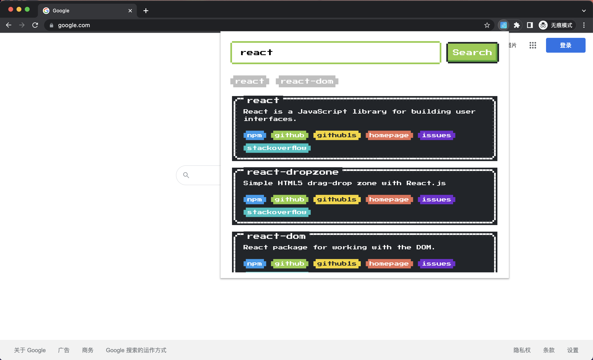

# npm-links

https://chrome.google.com/webstore/detail/npm-links/piplbfhgenihpimpoalcankenjecbjeb?hl=zh-CN&authuser=0

> Query the relevant shortcut links of NPM packages, such as github, NPM, homepage, github1s, stackhoverflow, and support redirection.

